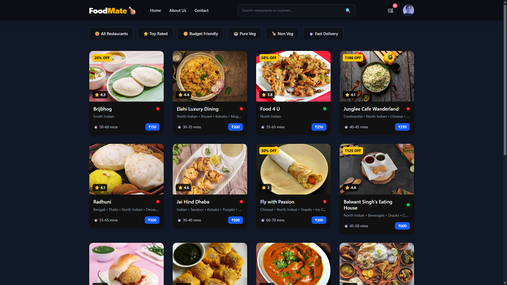
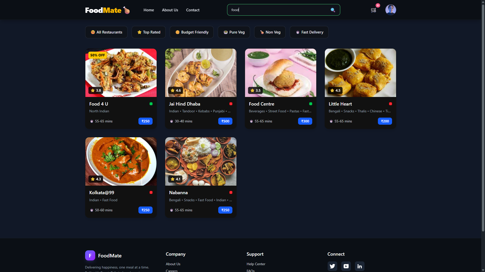
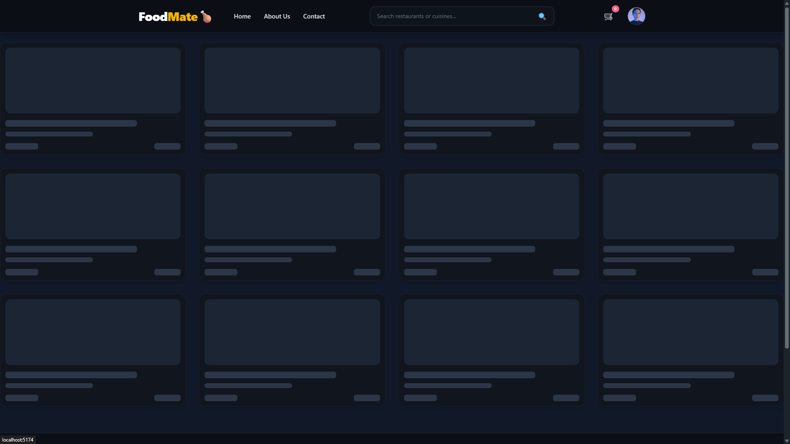
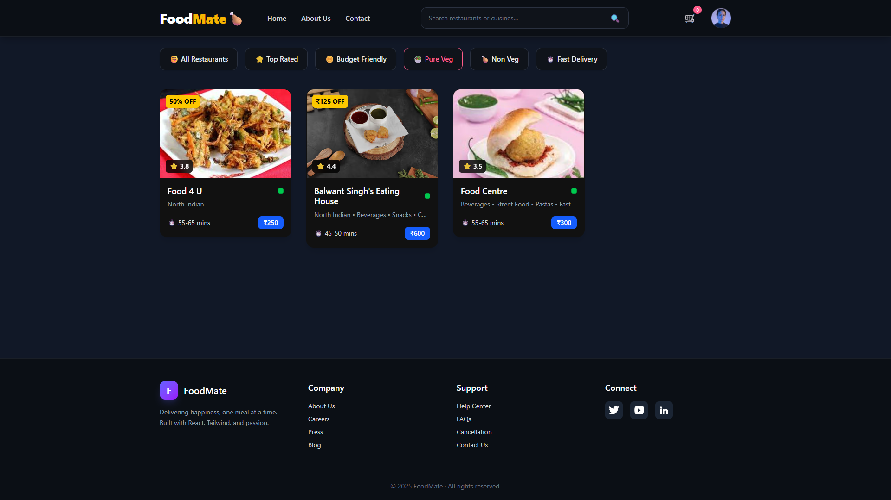
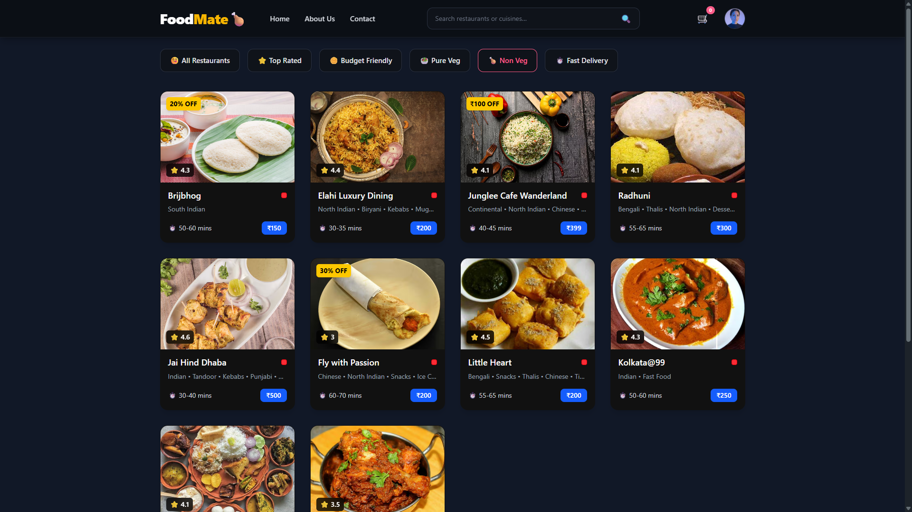
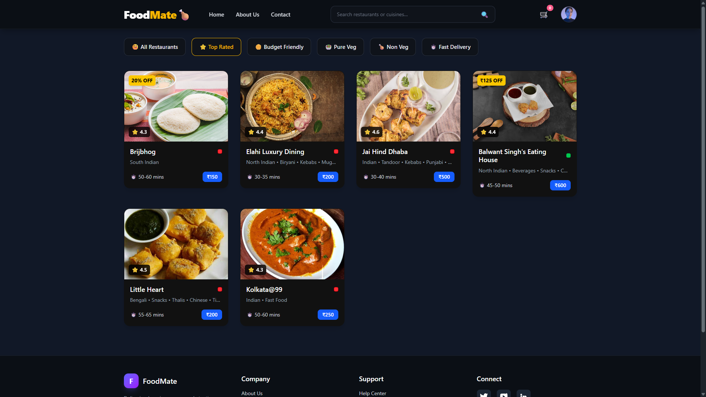
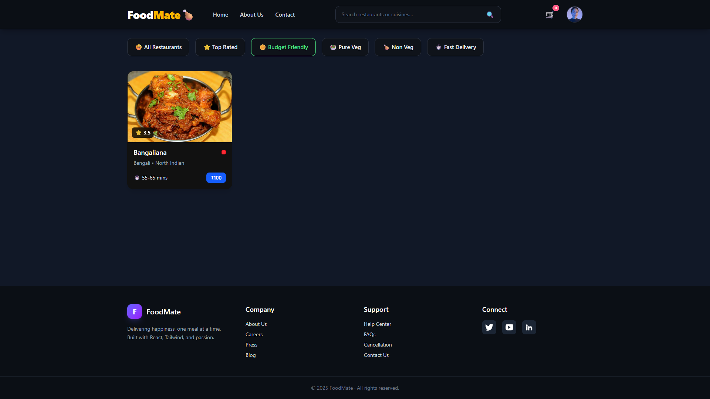
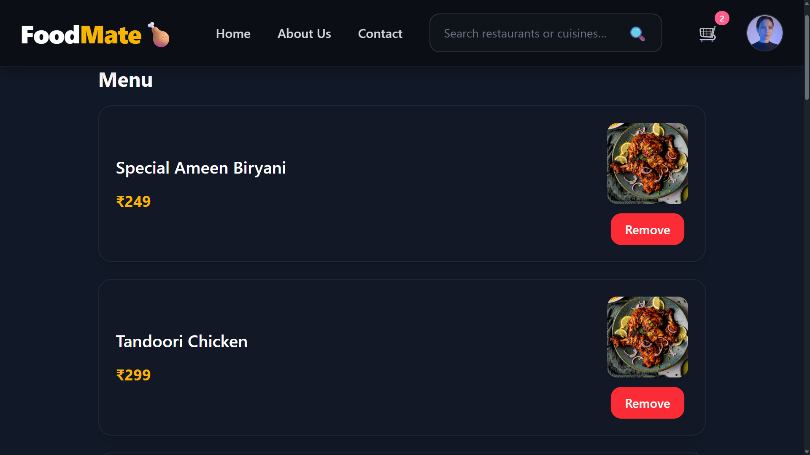
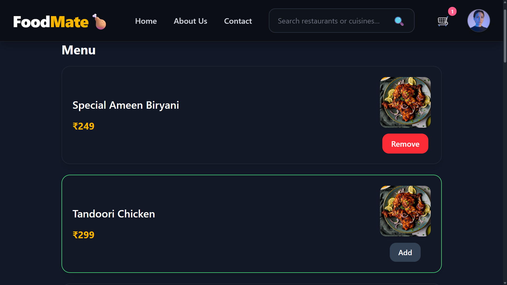
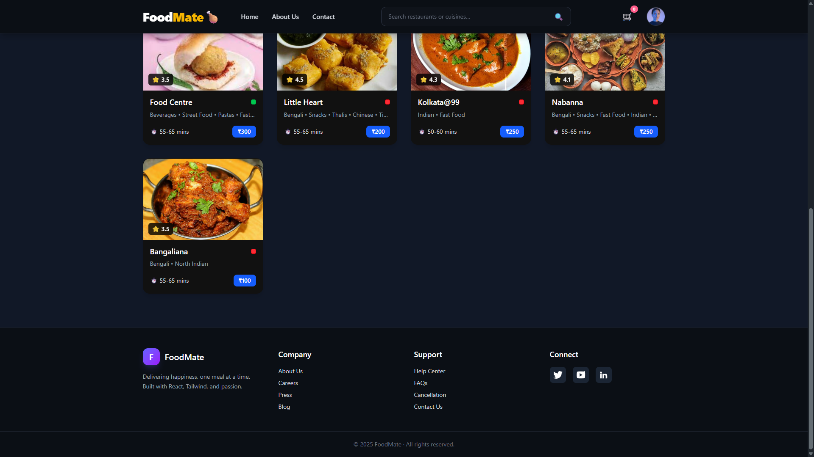

# 🚀 **FoodMate – Food Delivery App (React + Vite)**

<div align="center">

A blazing-fast, modern food delivery UI built with React, Vite, Tailwind & Zustand.
Designed to give users a smooth, app-like experience with lightning-fast search, filters, cart, and more.

<br/>

### 🏅 Tech Stack


<br/>

### 🎥 Preview

> Add a GIF here for maximum impact  
> (Example: `src/assets/preview.gif`)


<br/>
</div>
</div>

# ✨ **Features Overview**

- 🔍 Fast recipe search
- 🥗 Veg / Non-Veg category filters
- 💸 Budget & Top Rated filters
- 🛒 Cart system with Zustand
- ❤️ Add to favorites
- ⚡ Shimmer UI for instant loading experience
- 📱 Fully responsive UI
- 🚀 Ultra-fast development with Vite
- 🔗 Smooth navigation with React-Router

---

# 📸 **Screenshots**












---

# 🌍 **Live Demo**

👉 https://matchmate-frontend.vercel.app

---

# ⚙️ **Getting Started**

Follow these steps to run the project locally.

---

## **1️⃣ Clone the repository**

```bash

git clone https://github.com/SaikatGharami2001/foodmate-frontend.git
cd foodmate-frontend

```

## **2️⃣ Install dependencies**

```bash

npm install

```

## **3️⃣ Start development server**

```bash

npm run dev

```

## **4️⃣ Build for production**

- Responsive UI

```bash
npm run build
```

## **🧰 Technologies Used**

| Category         | Tech         |
| ---------------- | ------------ |
| Framework        | React, Vite  |
| State Management | Zustand      |
| Routing          | React Router |
| Styling          | Tailwind CSS |
| Deployment       | Vercel       |

## **🧱 Project Structure**

```bash

foodmate-frontend/
├── public/
│   └── favicon.ico
│
├── src/
│   ├── assets/                     # App images & previews
│   │   ├── About.png
│   │   ├── Budget.png
│   │   ├── Home.png
│   │   ├── NonVeg.png
│   │   ├── Search&Filter.png
│   │   ├── ShimmerUI.png
│   │   ├── TopRated.png
│   │   └── Veg.png
│   │
│   ├── components/                 # Reusable UI components
│   │   ├── About.jsx
│   │   ├── Body.jsx
│   │   ├── Card.jsx
│   │   ├── Contact.jsx
│   │   ├── Error.jsx
│   │   ├── Footer.jsx
│   │   ├── Navbar.jsx
│   │   ├── ResMenu.jsx
│   │   └── ShimmerUI.jsx
│   │
│   ├── store/                      # Zustand global store
│   │   └── useStore.js
│   │
│   ├── utils/                      # Utility helpers & mock data
│   │   ├── mockData.js
│   │   ├── restaurantMenu.js
│   │   └── utils.js
│   │
│   ├── app.css
│   ├── App.jsx                     # App shell + Routes
│   └── main.jsx                    # Vite entry point
│
├── .gitignore
├── eslint.config.js
├── index.html
├── package.json
├── package-lock.json
├── README.md
└── vite.config.js


```

## **🎯 Why I Built This**

FoodMate is a demonstration of real-world frontend engineering, focusing on:

- Performance-optimized UI
- Clean component architecture
- Zustand state management
- Routing patterns
- Real food delivery workflows (cart + filters)
- Production deployment on Vercel

## **🧠 What I Learned**

- Zustand store architecture
- Clean & reusable React components
- Performance tuning with Vite
- Designing UI systems with Tailwind
- Handling search, filters & cart logic
- Realistic app folder structuring

## **🧭 Roadmap**

- 🛵 Delivery status screen
- 🧧 Coupon & pricing system
- 🥗 Meal recommendations
- 🔥 Framer Motion animations
- 📲 Push notifications

## **👨‍💻 Author**

- Saikat Gharami
  GitHub: https://github.com/SaikatGharami2001

```

```
